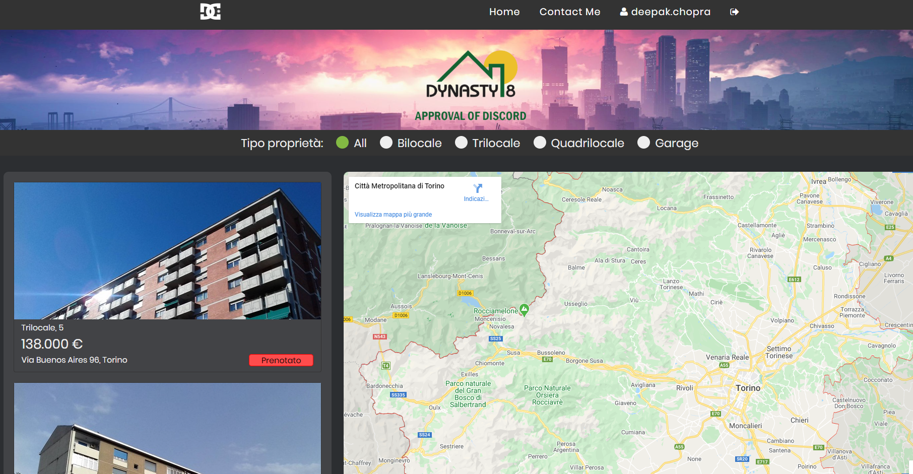
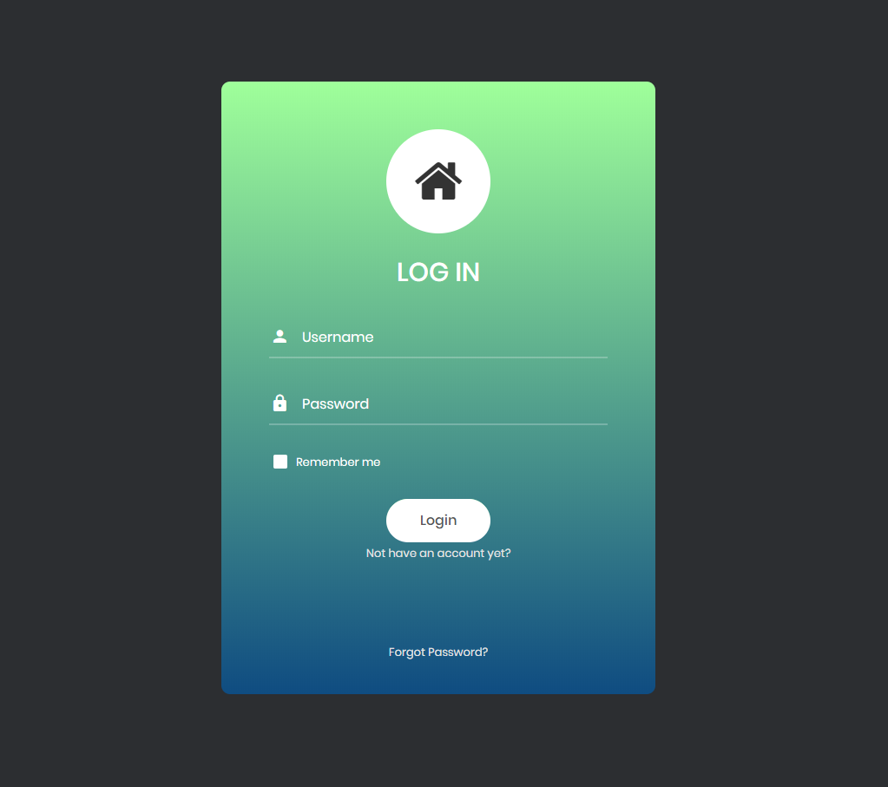
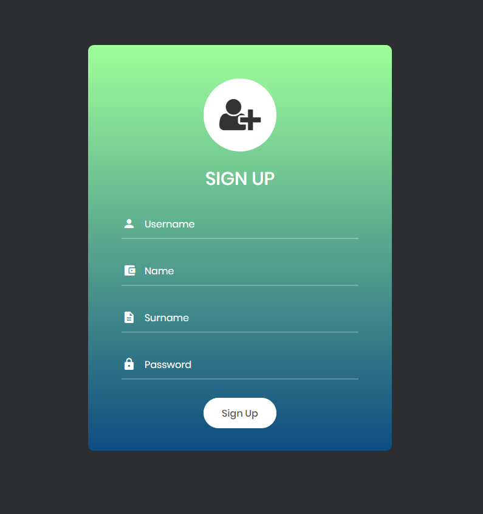

# Dynasty 8
#### Autore: Chopra Deepak

## Img Esempio

## Funzionamento
La pagina è strutturata nel seguente modo:
- navbar, che contiene il logo e alcuni button per le operazioni:
    il logo e il pulsante home ricaricano sempilcemente la pagina, mentre contact me porta a una pagina statica di contatto, e infine abbiamo il pulsante Login, per appunto, loggarsi
- header, con un logo e una sezione filtri contenente dei radio button, al change dei quale si aggiornano i dati
- sezione delle proprietà (a sinistra), in cui al caricamento della pagina vengono caricati e stampati i dati presi dal databse
- sezione mappa (a destra), non finita a causa dei problemi con Google maps api, però lo scopo era quello di visualizzare per ogni proprietà un segnaposto e al click avere una piccola descrizione(come il progetto geolocation fatto in terza)
- footer, con una breve descrizione

All'inizio non abbiamo utenti loggati, per cui non sono possibili operazioni come l'acquisto. Al click del pulsante Login si apre la seguente pagina: . E possibile accedere con admin (sia username che password) che permette di fare un operazione esclusiva: cancellazionePrenotazioni. Invece per gli altri utenti cambia lo username ma la password è sempre 'password'. Al click del bottone login(o tasto invio) se i dati sono corretti si torna alla pagina principale e lo username è mostrato al posto del bottone Login, con accanto anche il bottone per il logOut. 

L'operazione di acquista come detto è possibile solo si è loggati come cliente (non admin perchè ovviamente l'admin non deve acquistare niente), al click del bottone 'Acquista' viene aggiunto un record alla tabella delle 'vendite' e nella tabella della 'proprieta' viene aggiornato il flag 'Acquistata' a 1, così al riavvio dell'applicazione, quella proprieta non può essere acquistata nuovamente. Inoltre il bottone cambia testo e sfondo, sull'hover di esso viene mostrato un title con il nome dell'utente che ha 'acquistato' la proprieta(prenotato)   

### Registrazione nuovo utente
Per la registrazione, nella pagina di login, abbiamo sotto al button di sumbit un link alla pagina di registrazione. Dopo la registrazione, se è andato tutto a buon fine, l'utente viene riportato alla pagina di login per accedere con i nuovi dati(ho preferito questo modo così da verificare effettivamente che il database sia stato aggioranato).

## Database
Il database ha 3 tabelle:
- proprieta, i dati effettivi che vengono caricati e stampati
- user, i dati degli utenti registrati
- vendite, dove ogni volta che si prenota la visita a una proprieta(button acquista) viene creata un nuovo record con gli effettivi dati

### Struttura cartella
Per ciascun tipo di file abbiamo una cartella specifica:
- css -> per i file .css
- database -> contiene il database
- fonts -> contiene i fonts utilizzati per l'intera applicazione
- images -> contiene le foto utilizzate
- js -> per i file .js
- pagine -> contiene le altre pagine .html
- php -> per i file .php
- vendor -> cartella che contiene tutte le librerie neccesarie

## Bug e problemi
- A volte l'applicazione non esegue correttamente le query di update(nessun errore però la tabella non viene aggiornata)
- Per quanto riguarda la mappa, il codice perchè era motlo lungo e non funzionava del tutto, ho avuto problemi ad utilizzare l'Api di google maps e quindi per evitare che l'applicazione si blocasse per questo motivo ho preferito togliere il codice. Naturalmente proverò ancora a risolvere e se riesco in tempo le manderò la versione finale

## Team sviluppatori:
> 4B Info - Vallauri Fossano Italy